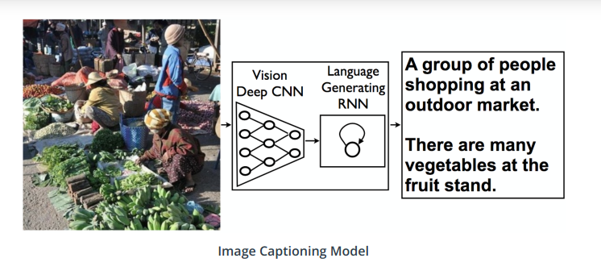

# Image Captioning

This project is about defining and training a CNN and RNN (LSTM) Networks in order to automatically generate captions given an Image.
This project is directly inspired by the @Udacity Computer Vision Nanodegree and has been modified in my way using <a href="https://pytorch.org/get-started/locally/">Pytorch</a>.

Dataset used for this project: <a href="https://www.kaggle.com/hsankesara/flickr-image-dataset">Flickr</a>

## File Description
- custom_data.py: Create the dataset using the Dataset class from Pytorch
- load_data.py: functions to split and load the data
- mapping.pkl: vocabulary mapping integer
- models.py: Create the architecture of the CNN and LSTM
- training.py: Train CNN and RNN on GPU
- Notebook_PDF/premilinaries.pdf:PDF version of the  Notebook: to ensure that all parts of the architecture (CNN and LSTM) work as expected
- transform.py: Python file that contains all classes to transform the data (images and captions)
- vocab.pkl: (Non unique) words in the dataset

## Authors
Medhy Vinceslas

## License
Project under the <a href='https://choosealicense.com/licenses/cc0-1.0/'>CC0-1.0</a> License

## Acknowledgement
Thank you to the @udacity staff for giving me the opportunity to improve my skills in Computer Vision.
